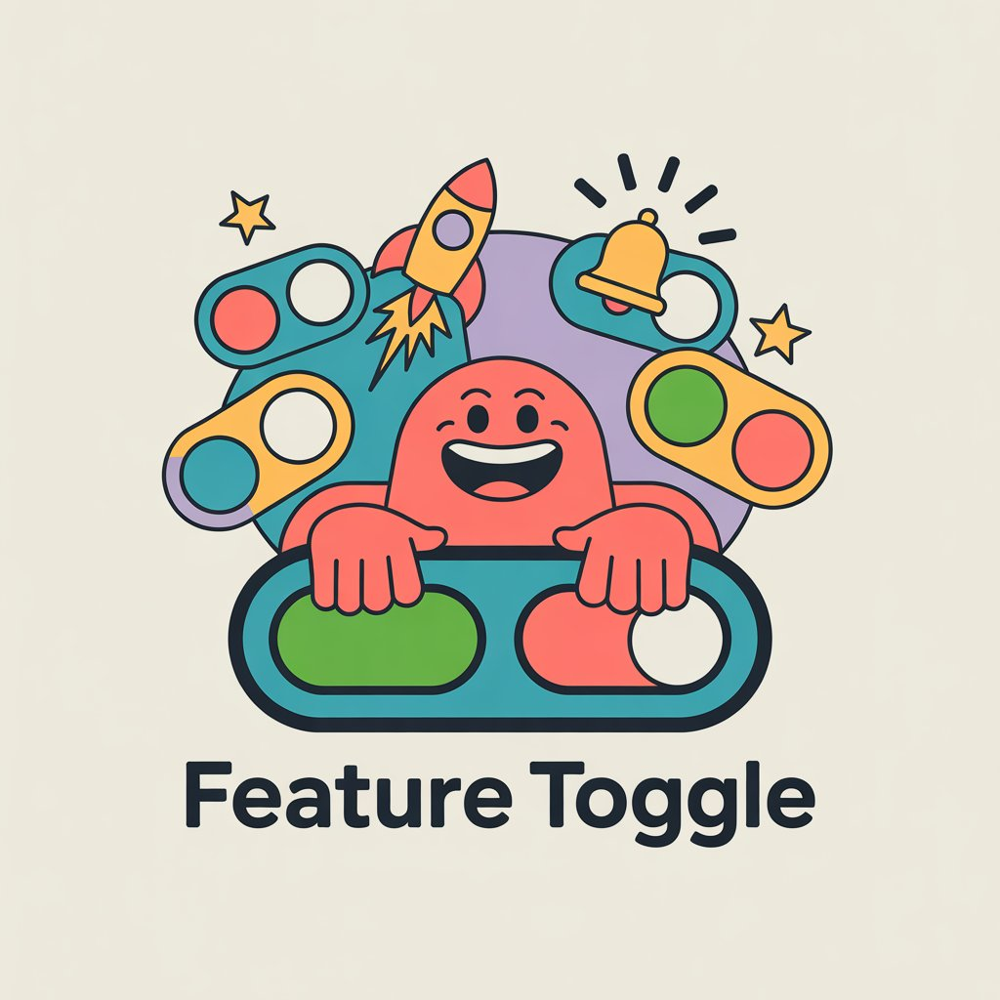

<div align="center">



# Homni Feature Toggle

Самостоятельно размещаемая платформа для управления фича-флагами с RBAC на уровне проектов, мультисредовым контролем и аутентификацией по API-ключам.

**[English documentation](README.md)**

[](https://github.com/homni-labs/feature-toggle/actions/workflows/docker-publish.yml)
[](LICENSE)
[](https://github.com/homni-labs/feature-toggle/releases)
[](https://github.com/homni-labs/feature-toggle)
[](https://hub.docker.com/r/zaytsevdv/homni-feature-toggle)

</div>

---

## Скриншоты

> Скоро здесь появятся скриншоты дашборда, управления тогглами и настроек проекта.

---

## Почему Homni?

Большинство решений для фича-тогглов либо доступны только как SaaS, либо не имеют нормального контроля доступа. Homni даёт вам:

- **Полный контроль** &mdash; разворачивайте на своей инфраструктуре, без привязки к вендору, без лимитов, данные не покидают вашу сеть
- **Изоляция проектов** &mdash; у каждого проекта свои тогглы, окружения, участники и API-ключи
- **Гранулярный RBAC** &mdash; Администратор платформы, Администратор проекта, Редактор, Читатель &mdash; чёткие границы прав на каждом уровне
- **Управление окружениями** &mdash; создавайте кастомные окружения для каждого проекта, не ограничиваясь DEV / STAGING / PROD
- **API по контракту** &mdash; спецификация OpenAPI 3.0 с кодогенерацией контроллеров, Swagger UI и скоупированными API-ключами

---

## Возможности

- &#x1F512; **OIDC-аутентификация** &mdash; Keycloak из коробки, совместимость с любым OpenID Connect провайдером. OAuth 2.1 + PKCE
- &#x1F4C1; **Изоляция проектов** &mdash; каждый проект — самодостаточное рабочее пространство со своими тогглами, окружениями, участниками и API-ключами
- &#x1F6E1; **Гранулярный RBAC** &mdash; Администратор платформы, Администратор проекта, Редактор, Читатель с детальной матрицей разрешений
- &#x1F30D; **Мультисредовой контроль** &mdash; создавайте и управляйте кастомными окружениями деплоя для каждого проекта
- &#x1F511; **Аутентификация по API-ключам** &mdash; скоупированные read-only токены с опциональным сроком действия для CI/CD пайплайнов и внешних сервисов
- &#x1F4D6; **OpenAPI 3.0** &mdash; полный контракт API с интерактивным Swagger UI по адресу `/docs`
- &#x1F5A5; **Панель управления** &mdash; полнофункциональный Flutter Web UI для управления проектами, тогглами, окружениями, участниками и API-ключами

---

## Быстрый старт

**1. Клонируйте репозиторий**

```bash
git clone https://github.com/homni-labs/feature-toggle.git
cd feature-toggle
```

**2. Запустите инфраструктуру** (PostgreSQL + Keycloak + Backend)

```bash
docker compose up -d
```

**3. Запустите фронтенд**

```bash
cd frontend
flutter pub get
flutter run -d chrome --web-port 3000
```

| Сервис | URL | Учётные данные |
|--------|-----|----------------|
| Фронтенд | [localhost:3000](http://localhost:3000) | `admin` / `admin` |
| Backend API | [localhost:8080](http://localhost:8080) | Bearer JWT |
| Swagger UI | [localhost:8080/docs](http://localhost:8080/docs) | &mdash; |
| Keycloak Admin | [localhost:8180](http://localhost:8180) | `admin` / `admin` |

> Предустановленные тестовые пользователи: `admin` / `admin` (Администратор платформы), `editor` / `editor`, `reader` / `reader`.

---

## Локальная разработка

### Предварительные требования

| Инструмент | Версия | |
|------------|--------|---|
| Java | 21+ | [adoptium.net](https://adoptium.net) |
| Maven | 3.9+ | [maven.apache.org](https://maven.apache.org) |
| Flutter | &ge; 3.2 | [flutter.dev](https://flutter.dev) |
| Docker & Compose | Последняя | [docs.docker.com](https://docs.docker.com) |

### Backend

Запустите только инфраструктурные сервисы:

```bash
docker compose up -d postgres keycloak
```

Запустите бэкенд из исходников (дефолтные значения совпадают с Compose-конфигурацией, дополнительная настройка не требуется):

```bash
cd backend
mvn spring-boot:run
```

Бэкенд запускается на порту **8080**. Liquibase автоматически выполняет миграции при старте.

### Frontend

```bash
cd frontend
flutter pub get
flutter run -d chrome --web-port 3000
```

Фронтенд запускается на порту **3000**. Конфигурация по умолчанию указывает на `localhost:8080` (API) и `localhost:8180` (Keycloak) &mdash; дополнительная настройка не требуется.

### Проверка работоспособности

```bash
# Проверка здоровья бэкенда
curl http://localhost:8080/actuator/health
# Ожидаемый ответ: {"status":"UP"}
```

- Swagger UI: откройте [localhost:8080/docs](http://localhost:8080/docs)
- Фронтенд: откройте [localhost:3000](http://localhost:3000), войдите под `admin` / `admin`

---

## Архитектура

- **Backend** &mdash; Гексагональная архитектура (Ports & Adapters) со строгим DDD. Доменный слой не имеет зависимостей от фреймворка. Подробнее в [backend/README_RU.md](backend/README_RU.md).
- **Frontend** &mdash; Чистая архитектура с модульной структурой по фичам (auth, projects, toggles, environments, members, API keys, users). BLoC/Cubit для управления состоянием с sealed-состояниями. Подробнее в [frontend/README_RU.md](frontend/README_RU.md).

---

## API

Аутентификация: **Bearer JWT** (OIDC) или заголовок **`X-API-Key`**.

Полная спецификация OpenAPI 3.0: [`backend/src/main/resources/openapi/api.yaml`](backend/src/main/resources/openapi/api.yaml)

Интерактивный Swagger UI доступен по адресу [`/docs`](http://localhost:8080/docs) при запущенном бэкенде.

---

## Конфигурация

### Backend

Все переменные имеют разумные значения по умолчанию для локальной разработки.

| Переменная | По умолчанию | Описание |
|------------|-------------|----------|
| `DB_HOST` | `localhost` | Хост PostgreSQL |
| `DB_PORT` | `5432` | Порт PostgreSQL |
| `DB_NAME` | `homni_feature_toggle` | Имя базы данных |
| `DB_USER` | `homni` | Пользователь БД |
| `DB_PASSWORD` | `homni` | Пароль БД |
| `OIDC_ISSUER_URI` | `http://localhost:8180/realms/feature-toggle` | URI OIDC-издателя |
| `OIDC_ADMIN_EMAIL` | `admin@homni.local` | Email первого администратора (назначается при первом входе) |
| `CORS_ORIGINS` | `*` | Разрешённые CORS-источники |
| `LOG_LEVEL` | `DEBUG` | Уровень логирования |

### Frontend

Константы времени компиляции, передаваемые через `--dart-define`. Значения по умолчанию работают из коробки для локальной разработки.

| Переменная | По умолчанию | Описание |
|------------|-------------|----------|
| `API_BASE_URL` | `http://localhost:8080` | URL Backend API |
| `OIDC_ISSUER` | `http://localhost:8180/realms/feature-toggle` | OIDC-издатель |
| `OIDC_CLIENT_ID` | `feature-toggle-frontend` | OIDC Client ID |
| `OIDC_REDIRECT_URI` | `http://localhost:3000/callback` | URI редиректа OIDC |
| `OIDC_POST_LOGOUT_REDIRECT_URI` | `http://localhost:3000/` | URI редиректа после выхода |

---

## Разрешения

| Действие | Админ платформы | Админ проекта | Редактор | Читатель | API-ключ |
|----------|:-:|:-:|:-:|:-:|:-:|
| Создание / архивация проектов | + | | | | |
| Управление пользователями платформы | + | | | | |
| Управление участниками | + | + | | | |
| Управление API-ключами | + | + | | | |
| Управление окружениями | + | + | | | |
| Создание / обновление / удаление тогглов | + | + | + | | |
| Включение / выключение тогглов | + | + | + | | |
| Чтение тогглов | + | + | + | + | + |

> **Администратор платформы** имеет неограниченный доступ ко всем проектам. Остальные роли действуют в рамках проекта. **API-ключ** предоставляет read-only доступ для машинной интеграции.

---

## Участие в разработке

1. Сделайте форк репозитория
2. Создайте ветку (`git checkout -b feature/amazing-feature`)
3. Закоммитьте изменения
4. Откройте Pull Request

Для крупных изменений, пожалуйста, сначала [создайте issue](https://github.com/homni-labs/feature-toggle/issues), чтобы обсудить предлагаемые улучшения.

Подробные рекомендации в [CONTRIBUTING.md](CONTRIBUTING.md).

**Безопасность** &mdash; если вы обнаружили уязвимость, **не** создавайте публичный issue. Свяжитесь напрямую через [Telegram](https://t.me/zaytsev_dv) или email zaytsev.dmitry9228@gmail.com.

---

## Дорожная карта

- [ ] Java SDK &mdash; нативная клиентская библиотека
- [ ] Аудит-лог &mdash; отслеживание всех действий пользователей
- [ ] Вебхуки &mdash; оповещение внешних систем при изменении состояния тогглов
- [ ] Тогглы по расписанию &mdash; автоматическое включение/выключение в заданное время
- [ ] Обнаружение устаревших тогглов &mdash; поиск тогглов, не менявшихся N дней
- [ ] Поддержка Authentik &mdash; готовая интеграция как альтернативный OIDC-провайдер
- [ ] Бэкенд на Quarkus &mdash; альтернативный легковесный runtime, готовый к использованию из коробки
- [ ] Observability &mdash; встроенные метрики, трейсинг и health checks для бэкенда

---

## Лицензия

Проект лицензирован под [MIT License](LICENSE).

<p align="center">Сделано с заботой в <a href="https://github.com/homni-labs">Homni Labs</a></p>
