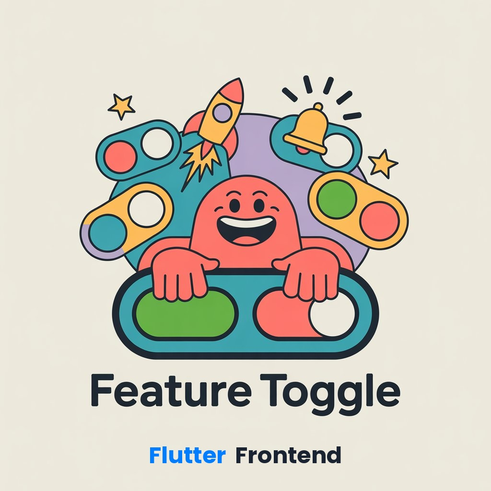

<div align="center">


# Feature Toggle Frontend

The management dashboard for [Homni Feature Toggle](https://github.com/homni-labs/feature-toggle-backend-spring) — a self-hosted feature flag platform with per-project RBAC, multi-environment control, and API key authentication.

[](https://flutter.dev)
[](https://bloclibrary.dev)
[](https://blog.cleancoder.com/uncle-bob/2012/08/13/the-clean-architecture.html)
[](LICENSE)

**[Документация на русском](README_RU.md)**

</div>

---

<!-- TODO: replace with actual screenshots -->
<p align="center">
  
</p>

<p align="center">
  &nbsp;
  
</p>

---

## Getting Started

### Prerequisites

- Flutter SDK >= 3.2 ([install](https://docs.flutter.dev/get-started/install))
- Running backend with Keycloak ([setup guide](https://github.com/homni-labs/feature-toggle-backend-spring#quick-start))

### Run

```bash
flutter pub get
flutter run -d chrome --web-port 3000
```

Open [localhost:3000](http://localhost:3000). Default credentials: `admin` / `admin`.

---

## What You Get

| | |
|-|-|
| **Project isolation** | Each project has its own toggles, environments, members, and API keys |
| **Toggle management** | Create, enable/disable, filter by status and environment, paginate |
| **Environment control** | Custom deployment targets per project — not limited to DEV/STAGING/PROD |
| **Team access** | Invite members with Admin, Editor, or Reader roles per project |
| **API keys** | Issue scoped tokens with expiration for SDK and CI/CD integration |
| **User administration** | Platform-wide user management for admins |
| **OIDC authentication** | OAuth 2.1 with PKCE, automatic token refresh, session management |

---

## Architecture

The frontend follows **Clean Architecture** with feature-based modularization. Each of the 7 feature modules is fully isolated with its own domain, application, infrastructure, and presentation layers.

```
lib/
├── app/            Entry point, DI, routing, theme
├── core/           Shared domain primitives and widgets
└── features/
    └── <feature>/
        ├── domain/           Models, value objects, repository ports
        ├── application/      Use-cases, Cubits, sealed states
        ├── infrastructure/   DTOs, mappers, HTTP repositories
        └── presentation/     Screens, widgets
```

### Design Decisions

| Decision | Rationale |
|----------|-----------|
| **Clean Architecture** | Strict layer separation makes features testable and replaceable independently |
| **BLoC/Cubit** | Predictable state management with sealed classes — no boolean flags, no ambiguous states |
| **Either&lt;Failure, T&gt;** | Errors are values, not exceptions. Every failure is typed, nothing is silently swallowed |
| **Value Objects** | `UserId`, `Email`, `ProjectRole` instead of raw strings — invalid state is unrepresentable |
| **One use-case = one class** | Single-responsibility, constructor-injected, max 15 lines |
| **No infrastructure in UI** | Presentation layer has zero knowledge of HTTP, JSON, or storage |

### Dependency Rule

```
presentation → application → domain ← infrastructure
```

Domain depends on nothing. Infrastructure implements domain ports. Presentation talks to application only.

---

## Tech Stack

| Layer | Technology | Why |
|-------|-----------|-----|
| Framework | Flutter 3.x (Web) | Single codebase, fast iteration, web-first |
| State | flutter_bloc | Cubit + Dart 3 sealed states, predictable rebuilds |
| Errors | fpdart | `Either<Failure, T>` — functional error handling without exceptions |
| DI | get_it | Lightweight, no code generation, lazy singletons |
| Auth | OIDC/PKCE | Standard protocol, works with Keycloak or any provider |
| HTTP | package:http | Minimal dependency, sufficient for REST |

---

## Project Structure

```
features/
├── auth/            OIDC login, token lifecycle, session
├── projects/        Workspace CRUD, settings, archive
├── toggles/         Feature flag CRUD, filtering, pagination
├── environments/    Deployment target management
├── members/         Per-project RBAC (Admin/Editor/Reader)
├── api_keys/        Token issuance and revocation
└── users/           Platform user administration
```

Each feature contains 19 use-cases, 8 cubits, 7 domain models with value objects, 6 repository ports with infrastructure implementations.

---

## Roadmap

- [ ] Mobile support (Android, iOS)
- [ ] Desktop support (macOS, Windows, Linux)
- [ ] Localization (i18n)
- [ ] Typed navigation (go_router)
- [ ] Audit log viewer
- [ ] Toggle search and bulk operations

---

## Contributing

1. Fork the repository
2. Create a feature branch
3. Commit your changes
4. Open a Pull Request

Please [open an issue](https://github.com/homni-labs/feature-toggle-app/issues) first for major changes.

**Security** — report vulnerabilities directly via [Telegram](https://t.me/zaytsev_dv) or zaytsev.dmitry9228@gmail.com. Do not use public issues.

---

## License

[MIT](LICENSE)

<p align="center"><a href="https://github.com/homni-labs">Homni Labs</a></p>
